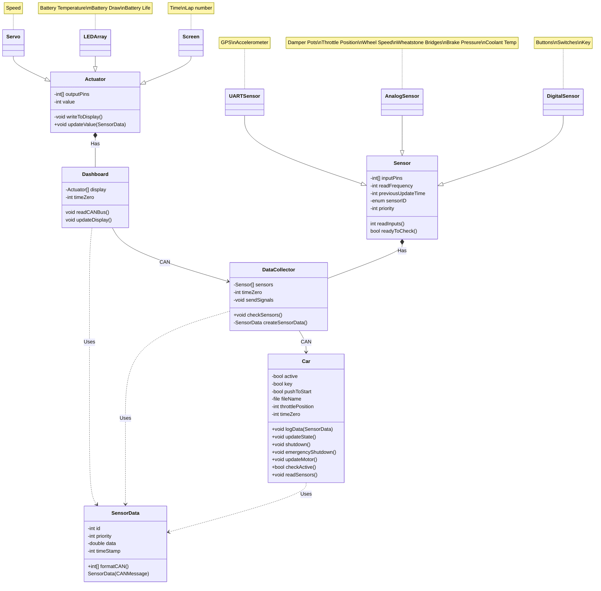

# BYU Racing #
### UML Diagram ###
by David Reinhardt and Dallin Stewart

|Revision History|             |                      |              |
|   :---   |       :---        |         :---         |     :---     |
| Revision |    Revised By     |    Checked By        |     Date     |
|    1.0   |  David Reinhardt  |   Dallin Stewart     | 19 SEPT 2023 |

