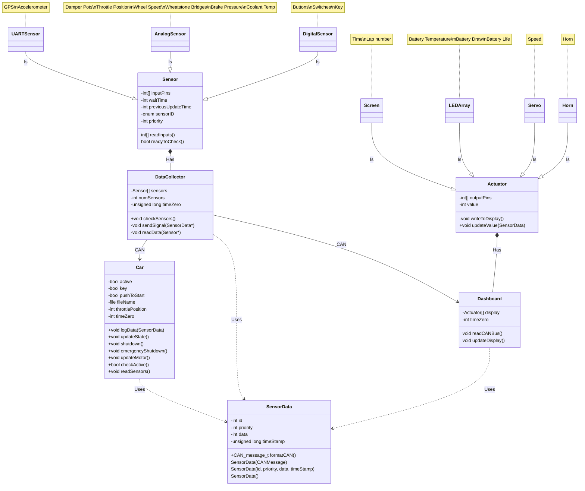

# BYU Racing
BYU Racing Team Repository
 BYU Racing Logo 

## Our Goals
 - Build a car that runs and won't break
 - Learn how to make next year's car better
 - Create networking and other opportunities for team members

## Requirements

<B>Rules</B>

### Rules
- Brake light [T.3.4]

- Accelerator system [T.4]
-  - Must have two electrically separate sensors 
- - Sensors must have different transfer functions
- - Sensor circuits must have resistors to make a short circuit result in a 0% reading
- - If a reading is received that is outside of the possible range, the motor controller must deactivate motor power
- - The motor controller may only accept up to a 10% difference in readings for 100 msec before deactivating motor power
- - Must have a detachable connector or switched breakout box to allow for disconnecting each sensor
- - ETC systems form must contain a detailed description of all possible failure modes including, but not limited to signal out of range, time outs, corrupted messages, and lost messages
- - Integrity of motor command signal must be maintained at all stages
- Brake system encoder (BSE) [T.4.3]
- - There must be a sensor for measuring brake line pressure or pedal position
- - If an abnormal or no reading is read for more than 100 msec, the motor power must be deactivated
- - The ETC systems form must contain a detailed description of all possible failure modes including, but not limited to signal out of range, time outs, corrupted messages, and lost messages
- Low Voltage Battery [T.9.2]
- - Low voltage batteries must be securely mounted within the chassis below the height of the shoulder belt mount
- - Low voltage batteries must have overcurrent protection that trips at or below the maximum specified discharge current of the cells
- - The positive terminal must be insulated
- - Any wet-cell battery in the driver’s compartment must be contained in a nonconductive marine type container or equivalent
- - Lithium chemistry battery packs must have a sturdy, rigid casing made from nonconductive material or be commercially available as an OEM style replacement
- - All batteries using chemistry other than lead-acid must be presented at technical inspection with markings identifying it for comparison to a datasheet or other documentation that prove that the pack and supporting electronics meet all rules requirements

- Grounded low voltage system general requirements [EV 4.4]
- - The grounded low voltage system must be below 60 V DC and must be grounded to the chassis
- - The grounded low voltage system must include two master switches that meet the following requirements: <B>[I think this is part of the shutdown circuit, but I am not completely sure]</B>
- - The grounded low voltage system must have a measuring point that is connected to the ground of the low voltage system 
- - - This measuring point must be next to the tractive system measuring point
- - - The measuring point must be be a black 4mm banana jack marked “GND”
- Vehicle operation
- - The vehicle must energize in the following manner: grounded low voltage active, tractive system active, then ready to drive.
- - Ready to drive 
- - - The vehicle will respond to motor inputs once the tractive system is active, the brake pedal is pressed and held, and the driver preforms a specific manual action to activate (such as pressing a specific button in the cockpit) 
- - - Once the ready to drive state is activated, the vehicle must make a ready to drive sound for one to three seconds that is easily recognizable and is at least 80 dBA

## UML Diagram
by David Reinhardt and Dallin Stewart

|Revision History|             |                      |              |
|   :---   |       :---        |         :---         |     :---     |
| Revision |    Revised By     |    Checked By        |     Date     |
|    1.0   |  David Reinhardt  |   Dallin Stewart     | 19 SEPT 2023 |
|    1.1   |  Dallin Stewart   |   David Reinhardt    | 25 SEPT 2023 |
|    1.2   |  Dallin Stewart   |   TBD                | 02 OCT 2023  |

----

>“Speed has never killed anyone. Suddenly becoming stationary, that’s what gets you.”
###### —Jeremy Clarkson 
