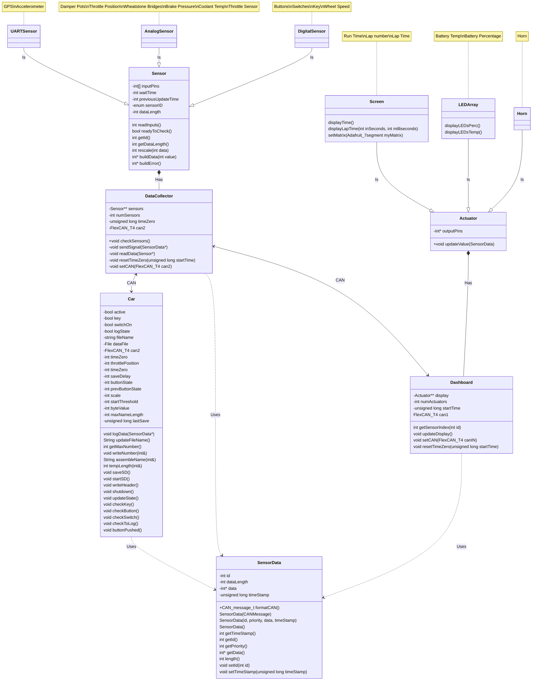

# BYU Racing

## UML Diagram

by David Reinhardt and Dallin Stewart

| Revision History |                 |                 |              |
| :--------------- | :-------------- | :-------------- | :----------- |
| Revision         | Revised By      | Checked By      | Date         |
| 1.0              | David Reinhardt | Dallin Stewart  | 19 SEPT 2023 |
| 1.1              | Dallin Stewart  | David Reinhardt | 25 SEPT 2023 |
| 1.2              | Dallin Stewart  | David Reinhardt | 02 OCT 2023  |
| 1.3              | Dallin Stewart  | David Reinhardt | 17 OCT 2023  |
| 1.4              | Coleman Hardy   | David Reinhardt | 31 MAR 2024  |
